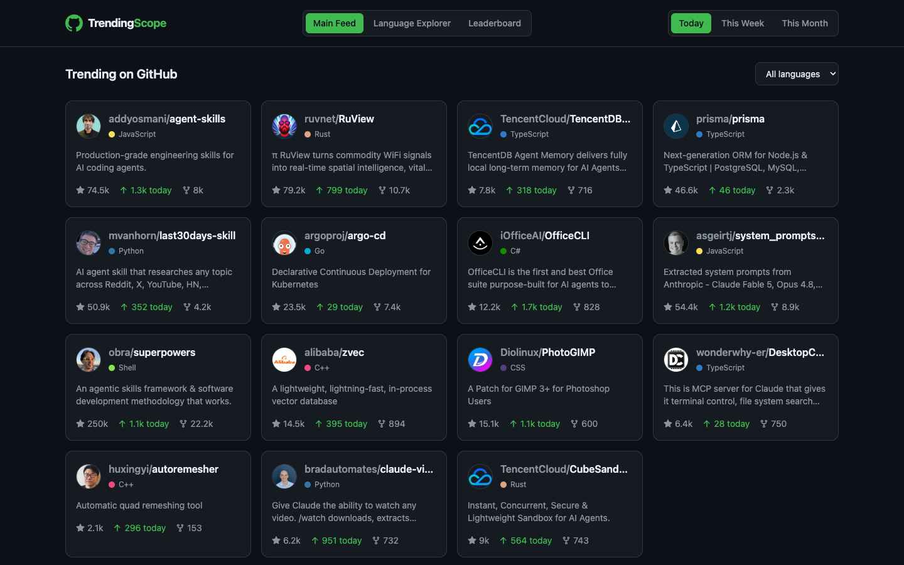
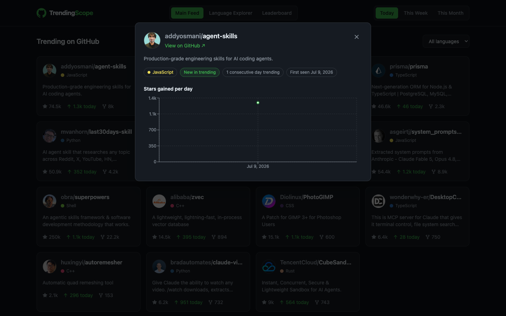
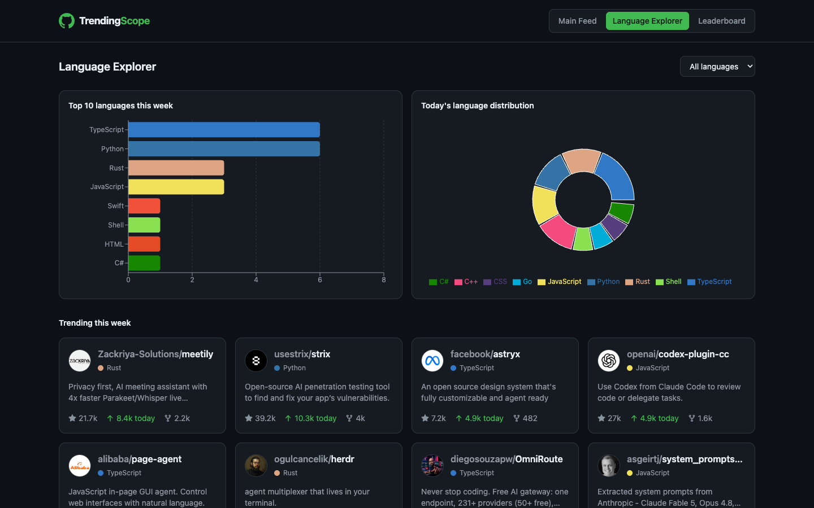
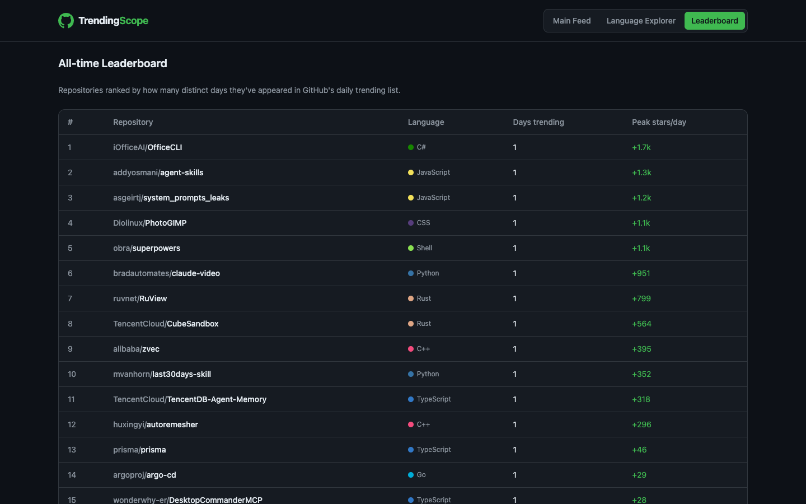

# TrendingScope

**GitHub's trending page is a snapshot. TrendingScope is the memory.**

Every day, thousands of repositories briefly flash onto [github.com/trending](https://github.com/trending) and then vanish back into obscurity — no history, no trends, no way to tell whether a repo is a flash in the pan or a genuine phenomenon. TrendingScope scrapes that page around the clock, stores every appearance, and turns it into something you can actually explore: star trajectories, language momentum, and the repositories that keep coming back.

## What you can discover

- **Is this repo still rising, or did it already peak?** Every repo's detail view plots stars gained per day since it first appeared in trending, so you can see the shape of its growth instead of a single frozen number.
- **Which languages are actually having a moment.** The Language Explorer compares the top languages over the past week against today's snapshot, so you can tell a genuine trend from one viral repo skewing the numbers.
- **Which repositories have staying power.** The Leaderboard ranks repos by how many distinct days they've held a spot in trending, surfacing the projects with real, sustained pull rather than a single lucky day.
- **What's hot right now, filtered your way.** The Main Feed shows the live trending list for Today / This Week / This Month, with a language filter and one-click detail view for every card.

## How it works

A scraper built on `httpx` + `BeautifulSoup` polls GitHub's trending page every 2 hours across three time windows (daily, weekly, monthly) and persists everything to SQLite — repo metadata, star/fork counts, and a timestamped snapshot per scrape. A FastAPI backend serves that data through a small set of endpoints, and a React + Recharts frontend turns it into the four views described above, styled after GitHub's own dark theme.

## Screenshots

| Main Feed | Repo Detail |
|---|---|
|  |  |

| Language Explorer | Leaderboard |
|---|---|
|  |  |

## Tech stack

- **Backend:** Python, FastAPI, SQLite, APScheduler
- **Scraping:** httpx, BeautifulSoup
- **Frontend:** React, Tailwind CSS, Recharts

<details>
<summary><strong>Getting started (installation & running locally)</strong></summary>

### Requirements

- Python 3.10+
- Node.js 18+

### Backend

```bash
cd backend
python3 -m venv venv
source venv/bin/activate
pip install -r requirements.txt
uvicorn app.main:app --reload --port 8000
```

On first run, the backend immediately scrapes all three trending periods (daily, weekly, monthly) so the app has data right away, then keeps re-scraping every 2 hours in the background. Data is stored in `backend/trendingscope.db` (SQLite, created automatically).

### Frontend

```bash
cd frontend
npm install
npm run dev
```

The frontend expects the API at `http://localhost:8000` by default. Override this with a `VITE_API_URL` environment variable if you deploy the backend elsewhere.

### API reference

| Endpoint | Description |
|---|---|
| `GET /trending?period=daily\|weekly\|monthly&language=all\|<language>` | Current trending list for a period, optionally filtered by language |
| `GET /repo/{owner}/{name}/history` | Star history and trending streak for a specific repo |
| `GET /languages` | All languages seen in the database |
| `GET /stats` | Aggregate stats: most repeated repos, language distribution, average stars today |
| `GET /leaderboard` | All-time ranking of repos by days spent in trending |

</details>
